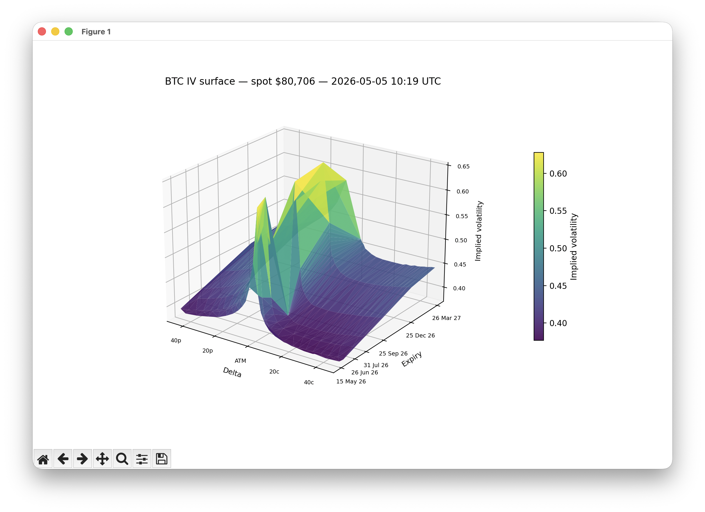

# Options Data

CLI tools that calculate greeks, implied volatilities, P/C ratios, and other metrics for options on BTC market based on real-time and historical data feeds.

## Features

- `--iv-surface` — fetches the full BTC option chain from Deribit, parses each instrument's strike and expiry, and plots the implied-volatility surface in 3D over **deltas** and **time to expiry**. IV values come directly from Deribit's `mark_iv`.


## Setup

```sh
$ git clone <this-repo>
$ cd options-data
$ python3 -m venv .venv
$ source .venv/bin/activate
$ pip install -r requirements.txt
```

A `.env` file with API keys may be needed in the future; the current `--iv-surface` feature uses only Deribit's public endpoints and does not require credentials.

## Usage

```sh
python cli.py --help          # list available features
python cli.py --iv-surface    # render the BTC IV surface (opens a matplotlib window)
```
