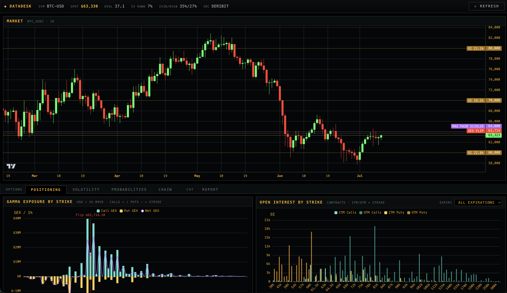

# Crypto Datadesk

Options and COT reports analytics for crypto markets based on real-time and historical data feeds.



## Features

- `iv-surface` - fetches the full option chain from Deribit, parses each instrument's strike and expiry and plots the implied-volatility surface in 3D over a delta-based moneyness axis and time to expiry. The axis is strike-monotonic - put wing on the left, ATM at the centre, call wing on the right (`10p … 25p … ATM … 25c … 10c`), so each expiry's smile reads left-to-right in strike. IV values come directly from Deribit's `mark_iv`.
- `iv-curves` - reuses the same option chain and plots the implied-volatility smile as 2D line curves, one per expiry, over strike. Each curve keeps the out-of-the-money leg (puts below the forward, calls above), so every expiry forms a clean U-shape. IV values come directly from Deribit's `mark_iv`.
- `term-structure` - plots the ATM implied-volatility term structure as a 2D line: one at-the-money IV point per expiry, spaced time-proportionally by days to expiry. The ATM IV is interpolated from each expiry's OTM smile to the forward (log-moneyness `ln(K/F) = 0`), revealing whether the vol market is in contango (upward) or backwardation (downward).
- `iv-skew` - plots the 25Δ skew term structure as two 2D lines over days to expiry: the risk reversal (`IV(25Δ call) - IV(25Δ put)`, skew direction) and the butterfly (`(25Δ call + 25Δ put)/2 - ATM IV`, wing richness). Wing IVs are interpolated over delta on each expiry's OTM smile; expiries without 25Δ coverage on both wings are skipped rather than extrapolated.
- `prob-curves` - plots the option implied-probability of currency expiring above each strike as 2D line curves, one per expiry, over strike. Each probability is the Black-76 digital under the forward measure - `P(S_T > K) = N(d2)`, computed per OTM quote from that strike's own `mark_iv`, so every expiry forms a downward-sloping S-curve (~100% deep ITM, ~0% deep OTM) with a dashed spot marker.
- `greeks` - computes the Black-76 option greeks (delta, gamma, theta, vega) for each contract in the OTM chain and plots each greek over strike for a selected expiry. Uses the forward convention already used for the surface/curves (undiscounted, `r = 0`, σ = `mark_iv`). Conventions: delta is dimensionless, gamma is per $1 forward move, vega is per 1 vol-point (1%), theta is per calendar day.
- `basis` - plots the annualized forward basis (`(F/S − 1)/T`) as one point per expiry over days to expiry, from the per-expiry forwards already carried by the term-structure response (no extra endpoint). Above zero = contango (forwards over spot), below = backwardation.
- `gex-by-strike` - plots dealer dollar gamma exposure by strike: the full OI chain joined with each strike's OTM gamma (the call and put of a strike share it), one signed bar per strike of `OI·Γ·F²·1%` - calls positive, puts negative (dealers long call / short put gamma) - plus the net-GEX line and a marker for the zero-gamma flip (the cumulative net-GEX zero crossing nearest spot).
- `oi-by-expiration` - plots open interest by expiration as one stacked bar per expiry, split into ITM/OTM calls and puts. Unlike the IV/greeks views it uses the full chain (every strike and expiry, dailies through LEAPS) and sums Deribit's per-contract `open_interest`. Moneyness is classified by strike vs the per-contract forward (call ITM when `strike < forward`, put ITM when `strike > forward`), deep-ITM and illiquid but OI-heavy contracts are kept.
- `spot-history` - plots the currency spot pair as a daily candlestick chart (trailing year, ~180-day default window) - the market-context strip with options-derived levels drawn: the GEX flip, the front-month max pain and the top-3 all-expiration OI walls (levels beyond ±30% of spot are omitted).
- `volume-by-strike` - plots 24h traded volume by strike as grouped call/put bars (contracts, same full chain as the OI views) - the flow companion to open interest's stock: OI shows where positioning sits, volume shows where today's activity is.
- `oi-by-strike` - plots open interest by strike as grouped ITM/OTM call/put bars (same full chain and moneyness rule as `oi-by-expiration`) with an all expirations filter. A summary row reports call/put/total OI, the put/call ratio, and notional value (`total OI × spot`). When a single expiry is selected it also overlays each strike's total intrinsic value (`Σ callOI·max(K−Kᵢ,0) + Σ putOI·max(Kᵢ−K,0)`, in USD) and marks the max-pain price - the strike that minimises it.
- `cot-report` - analyzes the weekly CFTC Commitments of Traders report (TFF futures-only) for the currency's CME futures contracts, standard + micro, aggregated into coin-equivalent units (for BTC: CME Bitcoin + Micro Bitcoin). The report table shows each participant category's (dealer, asset manager, leveraged funds, other reportables, non-reportable) long/short/net positioning with its week-over-week change; companion panels plot WoW net-flow bars, a causal rolling COT index (min-max or rank percentile, 0-100, 15/85 extreme zones) and the full net-positioning history over a linked price strip. Coverage is limited to currencies the CFTC publishes a futures contract for.

## Quick start (Docker)

```sh
docker compose up --build
```

Then open **http://localhost:8080**.


## Local development

Service:

```sh
cd core
python3 -m venv .venv
source .venv/bin/activate
pip install -r requirements.txt
uvicorn main:server --reload # serves http://localhost:8000
```

Dashboard:

```sh
cd dashboard
npm install
npm run dev # serves http://localhost:5173, proxies /api -> :8000
```

> Note: API docs are available at http://localhost:8000/docs.
